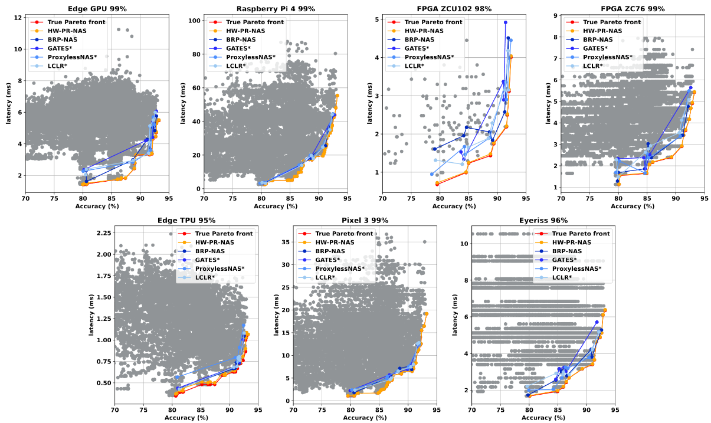

# HW-PR-NAS: Multi-Objective Hardware-Aware Neural Architecture Search with Pareto Rank-Preserving Surrogate Models 
Neural Architecture Search (NAS) is an extremely time-consuming process because we need to train each sampled architecture. Hardware-aware NAS increases the time complexity by evaluating other metrics such as the latency and energy consumption. Therefore, many works turn to surrogate models to estimate the performance of an architecture. However, in the context of multi-objective NAS, we found that using two surrogate models take us further away from the true Pareto front. 

> :warning: This code is under active development. Please be let us know of any bugs, improvements, and make sure to use the stable tag. 

**HW-PR-NAS**, Hardware-aware Pareto Rank Neural Architecture Search, present a single surrogate model trained to Pareto rank the architectures based on Accuracy, Latency and energy consumption. 


<p align="center">Overview of HW-PR-NAS Usage & Performance</p>

## Project Structure
```
HW-PR-NAS
│   README.md
│   test.py                   # test the whole system on NAS-Bench-201 
|   train.py                  # train the whole system using the dataset from HW-NAS-Bench 
|   search_algo.py
│   compute_metrics.py        # ranking correlation metrics
|   requirements.txt 
└───surrogate_models          # contains all the models' definitions 
│   │   latency_predictor.py 
│   │   accuracy_predictor.py 
│   │   energy_predictor.py 
│   |   base_surrogate.py    # general system & pareto rank loss 
└───search_spaces          # contains all the models' definitions 
│   │   fbnet.py 
│   │   nas_bench_201.py 
│   │   utils.py 
```

## How to use
### Add Benchmarks 
Include these downloaded file in a folder 'nas_benchmark' at the root of the project directory.
``` 
wget https://ndownloader.figshare.com/files/25506206?private_link=7d47bf57803227af4909 -O NAS-Bench-201-v1_0-e61699.pth
wget https://ndownloader.figshare.com/files/24693026 -O nasbench301_models_v0.9.zip
unzip nasbench301_models_v0.9.zip
```

Download HW-NAS-Bench from https://github.com/RICE-EIC/HW-NAS-Bench
Download the additional collected measurements on FPGA (ZCU102), [here](https://drive.google.com/file/d/1Yc1vQp1FiVZ8-_G1zfF9xZwkAuQB2XCR/view?usp=sharing) 

### Download Models weights

Weights of each model will be available : [HW-PR-NAS_Weights](https://figshare.com/articles/dataset/HW-PR-NAS_Weghts/16547724)

### Run test 
Run the file tests.py which lauches a multi-objective evolutionary algorithm on NAS-Bench-201 

```
python test.py 
```

## Results 


1. Results on CIFAR-10 on multiple hardware platforms 


 
 


 
